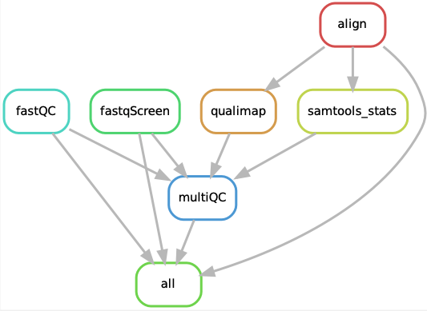

# QC-pipe

A [snakemake](https://snakemake.readthedocs.io) pipeline for generating QC metrics from sequencing data.

### What it does ###



QC-pipe takes as input fastq files and performs a number of quality control metrics, collated into a [MultiQC](https://multiqc.info/) report. The tools run include:

- [fastQC](https://www.bioinformatics.babraham.ac.uk/projects/fastqc/) -- a QC tool for sequencing data.
- [FastQ Screen](https://www.bioinformatics.babraham.ac.uk/projects/fastq_screen/) -- a screening tool that aligns reads to a set of sequence databases, to determine sequence composition.
- [QualiMap](http://qualimap.conesalab.org/) -- calculates QC metrics based on alignment data.
- [Samtools stats](https://www.htslib.org/doc/samtools-stats.html) -- produces statistics from alignment files.

QC-pipe can align your reads using [STAR](https://github.com/alexdobin/STAR) (recommended for RNA) or [bwa](http://bio-bwa.sourceforge.net/bwa.shtml) (recommended for DNA).

Additionally, QC-pipe can also demultiplex your data from Illumina bcls using [bcl2fastq](https://sapac.support.illumina.com/sequencing/sequencing_software/bcl2fastq-conversion-software.html) or [bcl-convert](https://sapac.support.illumina.com/sequencing/sequencing_software/bcl-convert.html), or from MGI data using [splitbarcode](https://github.com/MGI-tech-bioinformatics/splitBarcode). If you have multiple lanes, QC-pipe can automatically merge these into one pair of fastq files per sample.

### Installation ###

The only prerequisite is [snakemake](https://snakemake.readthedocs.io/en/stable/getting_started/installation.html). To install snakemake, you will need to install a Conda-based Python3 distribution. For this, [Mambaforge](https://github.com/conda-forge/miniforge#mambaforge) is recommended. Once mamba is installed, snakemake can be installed like so:

```
mamba create -c conda-forge -c bioconda -n snakemake snakemake
```

Now activate the snakemake environment (you'll have to do this every time you want to run the pipeline):

```
conda activate snakemake
```

Now clone the repository:

```
git clone https://github.com/WEHIGenomicsRnD/qc-pipe.git
cd qc-pipe
```

### Testing ###

You can test the pipeline via:

```
conda activate snakemake
snakemake --use-conda --conda-frontend mamba --cores 1 --directory .test
```

### Configuration ###

The configuration file is found under `config/config.yaml` and the config file for FastQ Screen is found under `config/fastq_screen.conf`. Please carefully go through these settings.

### Running ###

Place your fastq files in format of `{sample}_R[1|2].fastq.gz` under the the directory specific in your `config.yaml` file (`fastq` by default). Now run the pipeline as follows:

```
conda activate snakemake
snakemake --use-conda --conda-frontend mamba --cores 1
```

If you need to demultiplex your reads via bcl2fastq, bcl-convert or MGI's splitbarcode, you can run this through the pipeline by setting `process_from_bcl: True` in the config file and specifying the input BCL/fastq directory (`raw_input` in the config file). Note that due to the licensing of these demultiplexing tools, you will have to source the software from the Illumina website, or if you are using MGI, directly from MGI support.

You may also start the pipeline with already demultiplexed output. In this case, the pipeline can perform the merge step (in order to merge lanes). This is also handy if your file names are in the standard Illumina BCL output format. To do this, set the `merge_from_dir` parameter in the config file.

If you want to submit your jobs to the cluster using SLURM, use the following to run the pipeline:

```
conda activate snakemake
snakemake --use-conda --conda-frontend mamba --profile slurm --jobs 8 --cores 24
```

### Output ###

The pipeline will generate all results under a `results` directory. The most relevant directories are:

- `results/multiqc/multiqc_report.html` -- contains collated QC data in the form of an html report.
